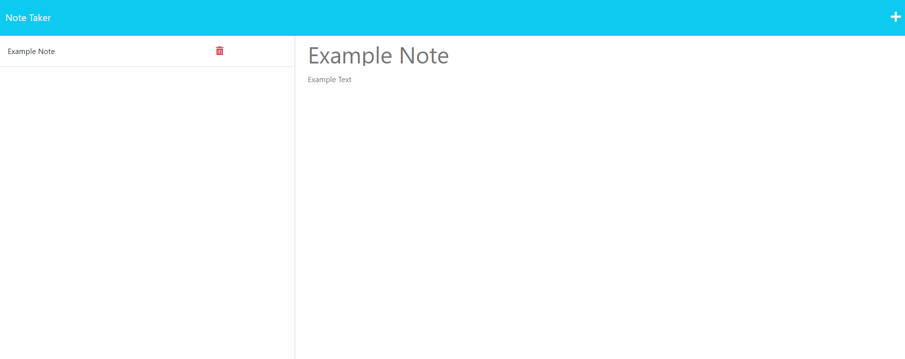

# Express Note Taker
[](https://opensource.org/licenses/MIT)

## Table of Contents
- [Description](#Description)
- [Installation](#Installation)
- [Usage](#Usage)
- [Testing](#Testing)
- [Contribution](#Contribution)
- [Contact](#Contact)

## Description
This is an application that provides a site to take notes on. Notes can be added using the "+" symbol on the top left, and can be saved to a sidebar on the left. Clicking on any note will bring you to the page displaying details of that note. The delete button is currently non-functional.

## Installation
To install the dependencies required for the application, run the following line in the terminal.

```
npm install
```

## Usage
To use the application, access the deployed page at (insert heroku link).

## Deployed Page
An image of the deployed page is shown below, with an example note pulled up to show the details of that note.



## Testing
N/A

## Contribution
N/A

## Contact
If you have questions, contact the author of the repository, Annie14254, at annieyashley@gmail.com.
